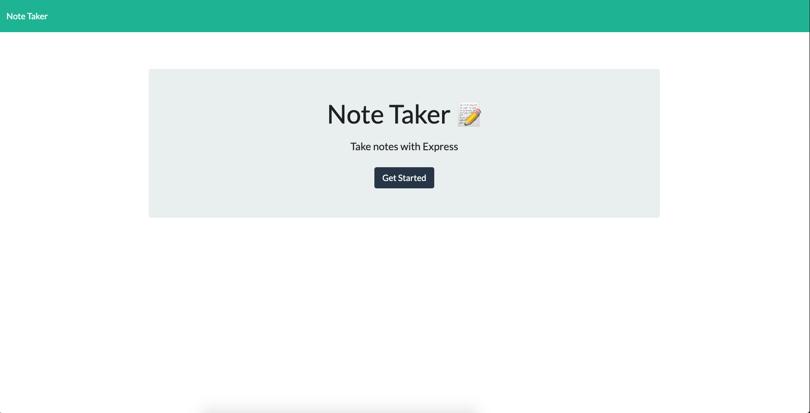

## Project Name

# Note Taker Application

> This application allows the user to enter and save notes, view previous notes and delete notes that are no longer needed.

#### [View The Site](#) - The project is not live.

---

### Table of Contents

- [Description](#description)
- [Technologies](#technologies)
- [Installation](#installation)
- [How To Use](#how-to-use)
- [Test(s)](#tests)
- [Contributors](#contributors)
- [Questions](#questions)
- [License](#license)

---

## Description

This application can be used to create, review and delete notes. Utilizing an express backend, the user can save and retrieve note data from a JSON file.  

The user is first presented with a landing page. From the landing page, the user is able to navigate to a 'notes' page where the user can interact with the app to create, review and delete notes.  

[Back To The Top](#project-name)

---

## Technologies

 

- Javascript, node.js, express.js, HTML, CSS

[Back To The Top](#project-name)

---

## Installation

Simply load the application in your browser by clicking this link.

#### [View The Site](#) - The project is not live.

[Back To The Top](#project-name)

---

## How To Use

Once the application is loaded in your browser follow these steps:
- Click the 'Get Started' button on the home page
- Enter your note title in the 'Note Title' field
- Enter your note content in the 'Note Text' field
- Click the computer disk icon to save your note
- Your notes will be displayed on the left column where you are able to click on each note to view it's content
- Click on the pen icon to create a new note
- Click the red trashcan icon for the note that you wish to delete

[Back To The Top](#project-name)

---

## Tests

There are no tests.

[Back To The Top](#project-name)

---

## Contributors

- Nate Valline

[Back To The Top](#project-name)

---

## Questions

Please contact the following for any questions.

  =>  contact@natevalline.com

[Back To The Top](#project-name)

---

## License

MIT License

Copyright (c) 2020 Nate Valline

Permission is hereby granted, free of charge, to any person obtaining a copy
of this software and associated documentation files (the "Software"), to deal
in the Software without restriction, including without limitation the rights
to use, copy, modify, merge, publish, distribute, sublicense, and/or sell
copies of the Software, and to permit persons to whom the Software is
furnished to do so, subject to the following conditions:

The above copyright notice and this permission notice shall be included in all
copies or substantial portions of the Software.

THE SOFTWARE IS PROVIDED "AS IS", WITHOUT WARRANTY OF ANY KIND, EXPRESS OR
IMPLIED, INCLUDING BUT NOT LIMITED TO THE WARRANTIES OF MERCHANTABILITY,
FITNESS FOR A PARTICULAR PURPOSE AND NONINFRINGEMENT. IN NO EVENT SHALL THE
AUTHORS OR COPYRIGHT HOLDERS BE LIABLE FOR ANY CLAIM, DAMAGES OR OTHER
LIABILITY, WHETHER IN AN ACTION OF CONTRACT, TORT OR OTHERWISE, ARISING FROM,
OUT OF OR IN CONNECTION WITH THE SOFTWARE OR THE USE OR OTHER DEALINGS IN THE
SOFTWARE.

[Back To The Top](#project-name)

---
    